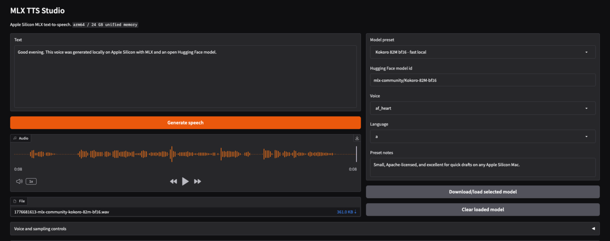

# MLX TTS Studio

[](https://github.com/rorystandley/mlx-tts-studio/actions/workflows/ci.yml)

A local text-to-speech app for Apple Silicon Macs. It uses [MLX Audio](https://github.com/Blaizzy/mlx-audio) to run Hugging Face TTS models through MLX, with a Gradio UI for text, voices, sampling controls, reference audio, and saved audio output.

MLX TTS Studio is standalone. It can be used directly in the browser or as a small local HTTP speech service for any other tool that can call a local endpoint.



## Requirements

- Apple Silicon Mac running arm64 Python.
- Python 3.12.
- [`uv`](https://docs.astral.sh/uv/) for dependency management.
- Enough free disk space for whichever Hugging Face model weights you download.

## Model choice

The app includes `kugelaudio/kugelaudio-0-open`, because it is the strongest strictly open-source preset here and is MIT licensed. It is a 7B model, so it is happiest on Macs with 32 GB+ unified memory and can take several minutes on the first run.

The default startup preset is now `mlx-community/Kokoro-82M-bf16`, because it is the most supportable choice while another local LLM is already running. It is small, fast, and much less likely to push a 24 GB Apple Silicon machine into memory pressure.

The app also includes practical fallbacks:

- `mlx-community/Voxtral-4B-TTS-2603-mlx-bf16` for strong open-weight quality and multilingual voice presets.
- `mlx-community/Qwen3-TTS-12Hz-1.7B-VoiceDesign-bf16` for promptable voice design.
- `mlx-community/Qwen3-TTS-12Hz-1.7B-CustomVoice-bf16` for named Qwen3 speakers.
- `mlx-community/chatterbox-turbo-fp16` for expressive TTS and reference-audio workflows.
- `mlx-community/Kokoro-82M-bf16` for very fast local generation on smaller Macs.

Check each Hugging Face model card before commercial use. "Open weights" and "open-source license" are not always the same thing.

## Run

```bash
git clone https://github.com/rorystandley/mlx-tts-studio.git
cd mlx-tts-studio
uv sync
./run.sh
```

Then open:

```text
http://127.0.0.1:7860
```

The first generation with a model downloads its weights from Hugging Face into the normal HF cache. `Download/load selected model` performs that step up front and keeps the model warm in memory for the next generation. KugelAudio and Voxtral are large; Kokoro is the quick smoke-test and low-memory option. Setting `HF_TOKEN` can make Hugging Face downloads more reliable and avoid anonymous rate limits.

Model weights are cached under the Hugging Face hub cache, usually:

```text
~/.cache/huggingface/hub/
```

Use the `Model cache` panel in the app to refresh downloaded model sizes or delete the cache for the currently selected model id. The table also explains what each built-in preset is good for and estimates how suitable it is for the machine currently running the app, based on Apple Silicon/arm64 support and detected unified memory. Deleting a cache does not remove generated audio files; it only removes the downloaded Hugging Face model snapshot/blobs for that model.

Generated audio files are written to `outputs/`, which is intentionally ignored by Git.

## Configuration

These optional environment variables are useful for local runs:

| Variable | Default | Purpose |
|---|---|---|
| `GRADIO_SERVER_NAME` | `127.0.0.1` | Bind address for the local server |
| `GRADIO_SERVER_PORT` | `7860` | Local server port |
| `DEFAULT_TTS_PRESET_LABEL` | `Kokoro 82M bf16 - fast local` | Startup preset label |
| `HF_TOKEN` | unset | Hugging Face token for higher rate limits/private models |
| `HF_HOME` | `~/.cache/huggingface` | Hugging Face cache root |
| `HF_HUB_CACHE` | derived from `HF_HOME` | Hugging Face hub cache directory |

## Local API

The same process serves the Gradio UI and a local API:

- `GET /health` reports runtime, cache, output, default model, and loaded model state.
- `GET /models` lists presets plus cache rows.
- `POST /synthesize` returns JSON with a generated local audio file path.
- `POST /v1/audio/speech` returns audio bytes in a small OpenAI-compatible shape.

Example:

```bash
curl -X POST http://127.0.0.1:7860/synthesize \
  -H 'Content-Type: application/json' \
  -d '{"input":"Hello from local MLX TTS.","model":"mlx-community/Kokoro-82M-bf16","voice":"af_heart","lang_code":"a","audio_format":"wav"}'
```

## Tips

- Use `Download/load selected model` before the first Voxtral or KugelAudio generation.
- Use `Model cache` to see which models are taking disk space.
- Use `Kokoro 82M bf16` if you want to verify the app quickly or keep memory pressure low.
- Use `Clear loaded model` before switching away from a large model.
- For Qwen3 VoiceDesign, put the voice description in `Instruction`.
- Reference audio support depends on the selected model.

## Development

Run the focused checks before committing:

```bash
uv run ruff format .
uv run ruff check .
uv run python -m py_compile app.py tts_service.py
```

Do not commit model weights, generated audio, local `.env` files, or Hugging Face caches.

GitHub Actions runs the same quality checks plus a lightweight API smoke test on pushes and pull requests. The smoke test does not download model weights.

## License

This project is released under the MIT License. Model weights are distributed separately by their respective authors and may have different licenses or usage terms.
